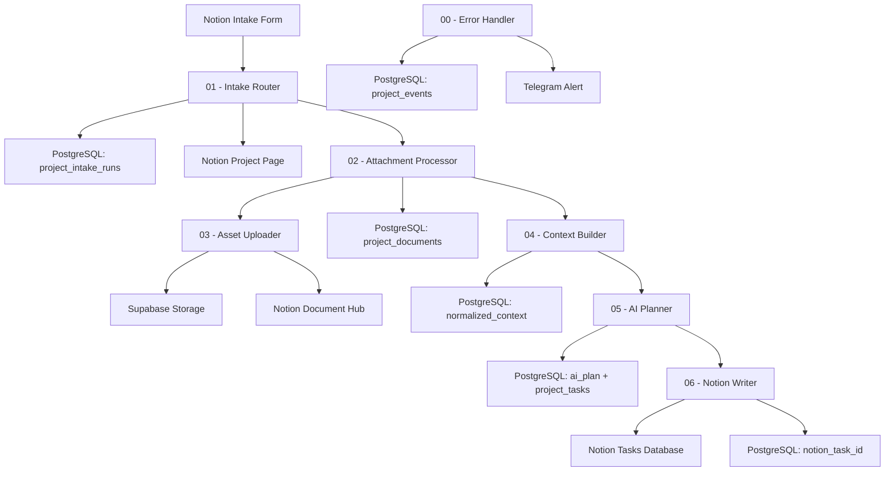

# Architecture

The Project Intake Agent is a modular n8n automation system for converting Notion intake submissions into structured project plans and Notion task records.

## High-level flow

## Core design choices

- The workflow is split into reusable modules instead of one monolithic n8n canvas.
- PostgreSQL stores run state, document rows, AI plans, task rows, and error events.
- Notion remains the human-facing workspace for project pages, documents, and tasks.
- Supabase Storage is used for durable uploaded file storage.
- The AI Planner is guarded by parsing and normalization logic before tasks are saved.
- Missing inputs are converted into a Discovery task instead of blocking the workflow.
