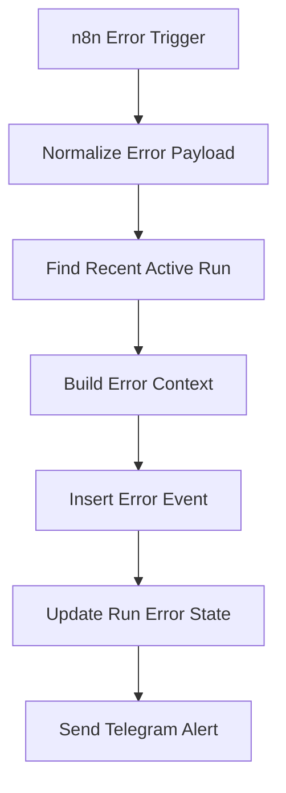

# Error Handling

The repository uses a global `00 - Error Handler` workflow.

## Flow

## Design

- Critical workflow failures trigger Telegram.
- Run error state is stored in `project_intake_runs`.
- Detailed events are stored in `project_events`.
- Notion project status is not used for failures because Notion status is reserved for project progress.

## Recommended production improvement

Store `$execution.id` and `$workflow.name` at the start of each workflow, then let Error Handler find the exact run by `last_execution_id` rather than using the latest active run.
