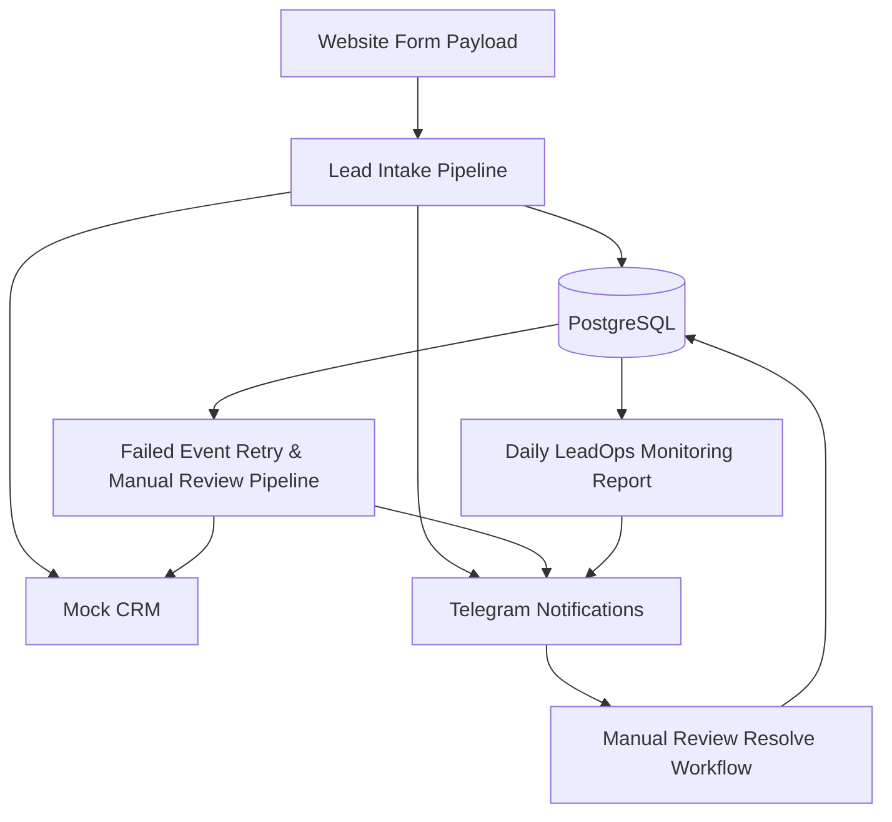
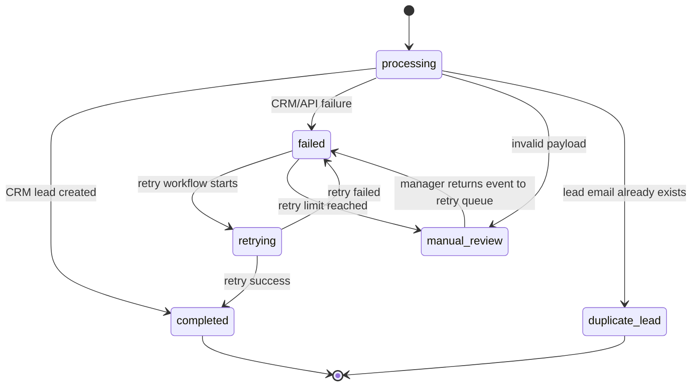

# Reliable LeadOps Automation System

A portfolio-grade automation system built with **n8n** and **PostgreSQL** for reliable lead intake, CRM lead creation, failed event retry, manual review recovery, and daily operational monitoring.

This project demonstrates how workflow automation can be designed beyond the happy path: with state management, duplicate prevention, structured error handling, retry logic, observability, and human-in-the-loop recovery.

---

## Table of Contents

* [Overview](#overview)
* [Problem](#problem)
* [Solution](#solution)
* [System Architecture](#system-architecture)
* [Workflow Overview](#workflow-overview)
* [Database Design](#database-design)
* [Event Lifecycle](#event-lifecycle)
* [Reliability Patterns](#reliability-patterns)
* [Monitoring Report Example](#monitoring-report-example)
* [Repository Structure](#repository-structure)
* [Testing Scenarios](#testing-scenarios)
* [Production Considerations](#production-considerations)
* [Key Takeaways](#key-takeaways)

---

## Overview

The system receives lead submissions from a website form, stores raw events, validates and normalizes lead data, prevents duplicate processing, creates leads in a mock CRM, retries failed events, escalates unresolved cases to manual review, and sends daily operational reports to Telegram.

The goal of this project is to model a realistic LeadOps automation ecosystem rather than a single isolated workflow.

---

## Problem

Many workflow automations only handle the ideal scenario:

1. A form is submitted.
2. A lead is created in a CRM.
3. A notification is sent.

However, real integration workflows need to handle more complex cases:

* duplicate form submissions
* duplicate leads
* invalid payloads
* CRM/API failures
* temporary outages
* retry scheduling
* manual review
* operational monitoring

Without state management and observability, it becomes difficult to understand what happened, what failed, and whether an event can be safely retried.

---

## Solution

This project solves the problem by using **n8n as the orchestration layer** and **PostgreSQL as the state layer**.

The system stores every incoming event, tracks its processing status, logs important workflow steps, retries failed events, and sends monitoring reports.

Core capabilities:

* receive and normalize lead payloads
* store raw events as JSONB
* validate required lead fields
* prevent duplicate event processing
* prevent duplicate lead creation
* simulate CRM lead creation
* handle structured CRM errors
* retry failed events
* escalate unresolved events to manual review
* return manually reviewed events to the retry queue
* send success, failure, manual review, and monitoring notifications

---

## System Architecture



The system is organized into several architectural layers:

| Layer                  | Responsibility                                                  |
| ---------------------- | --------------------------------------------------------------- |
| Workflow orchestration | n8n controls execution, branching, and scheduling               |
| State management       | PostgreSQL stores event status, leads, retry metadata, and logs |
| Reliability            | Deduplication, idempotency, retry scheduling, manual review     |
| Observability          | Workflow logs, Telegram alerts, daily reports                   |
| Human operations       | Manual review and retry recovery                                |

More details: [`docs/architecture.md`](./docs/architecture.md)

---

## Workflow Overview

The system consists of four connected n8n workflows.

### 1. Lead Intake Pipeline

Handles new website form submissions.

Main responsibilities:

* receive form payload
* normalize event and lead data
* validate required fields
* insert raw event into PostgreSQL
* check duplicate events by `external_id`
* check duplicate leads by email
* create lead in mock CRM
* insert lead into local database
* update event status
* send Telegram notification
* write workflow logs

### 2. Failed Event Retry & Manual Review Pipeline

Runs on schedule and reprocesses failed events.

Main responsibilities:

* find failed events eligible for retry
* mark event as `retrying`
* rebuild normalized lead data from `raw_events.payload`
* validate rebuilt payload
* check if lead already exists
* retry CRM lead creation
* mark event as `completed` after success
* increment retry count after failure
* schedule next retry with `next_retry_at`
* move unresolved events to `manual_review`

### 3. Manual Review Resolve Workflow

Provides a simple human-in-the-loop recovery mechanism.

Main responsibilities:

* receive `event_id` from a webhook link
* check if event is in `manual_review`
* move event back to `failed`
* reset retry metadata
* set `next_retry_at = NOW()`
* write `manual_review_resolved` log
* allow retry workflow to process the event again

### 4. Daily LeadOps Monitoring Report

Sends a daily operational health report to Telegram.

Main responsibilities:

* count events by status
* count new leads
* calculate failure rate
* summarize top lead sources
* summarize retry activity
* list recent problem events
* send monitoring report to Telegram

Workflow exports are available in [`workflows/`](./workflows).

---

## Database Design

PostgreSQL is used as the system of record for event state, lead data, and workflow logs.

### Main Tables

| Table           | Purpose                                                  |
| --------------- | -------------------------------------------------------- |
| `raw_events`    | Stores original incoming events and processing lifecycle |
| `leads`         | Stores successfully created leads                        |
| `workflow_logs` | Stores operational logs for workflow steps               |

### `raw_events`

Stores the original form payload and the lifecycle state of each event.

Important fields:

* `external_id`
* `payload`
* `event_source`
* `processing_status`
* `error_message`
* `retry_count`
* `last_retry_at`
* `next_retry_at`
* `manual_review_reason`
* `created_at`
* `updated_at`
* `processed_at`

### `leads`

Stores successfully created leads.

Important fields:

* `external_id`
* `event_id`
* `lead_name`
* `lead_email`
* `lead_phone`
* `lead_source`
* `status`

### `workflow_logs`

Stores step-level operational logs.

Important fields:

* `event_id`
* `lead_id`
* `step_name`
* `status`
* `wf_message`

Database files:

* [`database/schema.sql`](./database/schema.sql)
* [`database/indexes.sql`](./database/indexes.sql)
* [`database/dbml.dbml`](./database/dbml.dbml)
* [`database/sample-payloads.json`](./database/sample-payloads.json)

---

## Event Lifecycle

The main event state is stored in `raw_events.processing_status`.



Important rule:

`completed` is only set after the event has passed through the normal processing path successfully. Manual review does not directly mark an event as completed; it returns the event to the retry queue.

More details: [`docs/event-lifecycle.md`](./docs/event-lifecycle.md)

---

## Reliability Patterns

This project demonstrates several reliability patterns commonly needed in integration systems.

### Idempotency

Incoming events are checked by `external_id` to avoid processing the same form submission multiple times.

### Lead Deduplication

Leads are checked by normalized email before CRM creation. The local `leads.lead_email` field also has a unique constraint.

### Raw Event Storage

The original payload is stored as JSONB in `raw_events.payload`, enabling debugging, replay, retry, and manual inspection.

### Structured Error Handling

The mock CRM returns API-like structured responses:

* `crm_success`
* `crm_error`
* `crm_status_code`
* `crm_error_message`
* `crm_response`

This separates business/API errors from technical workflow execution errors.

### Retry Scheduling

Failed events use:

* `retry_count`
* `last_retry_at`
* `next_retry_at`

The retry workflow only processes events that are eligible for retry.

### Manual Review

Invalid or unresolved events are moved to `manual_review`, where a human can inspect the payload and return the event to the retry queue.

### Observability

Important workflow steps are written to `workflow_logs`.

Example step names:

* `raw_event_inserted`
* `duplicate_event_check`
* `lead_lookup_by_email`
* `crm_lead_created`
* `retry_started`
* `retry_success`
* `retry_failed`
* `manual_review_required`
* `manual_review_resolved`
* `notification_sent`

More details: [`docs/reliability-patterns.md`](./docs/reliability-patterns.md)

---

## Monitoring Report Example

```text
📊 LeadOps Daily Monitoring Report

Status: 🚨 Needs attention

Last 24 hours:
- Total events: 5
- Completed: 4
- Failed: 0
- Manual review: 1
- Duplicate leads: 0
- Retrying: 0
- Failure rate: 0.00%

Leads:
- New leads: 4

Top lead sources:
- google: 1
- organic: 1
- linkedin: 1
- twitter: 1

Retries:
- Started: 0
- Success: 0
- Failed: 0
- Manual review required: 0

Recent problem events:
- Event: subm_20260529_00005
  Status: manual_review
  Retries: 0
  Error: Validation failed: missing_email
```

---

## Repository Structure

```text
reliable-leadops-automation-system/
│
├── README.md
│
├── workflows/
│   ├── lead-intake-pipeline.json
│   ├── failed-event-retry-manual-review-pipeline.json
│   ├── manual-review-resolve.json
│   └── daily-leadops-monitoring-report.json
│
├── database/
│   ├── schema.sql
│   ├── indexes.sql
│   ├── sample-payloads.json
│   └── dbml.dbml
│
├── docs/
│   ├── architecture.md
│   ├── event-lifecycle.md
│   ├── reliability-patterns.md
│   └── testing-scenarios.md
│
└── screenshots/
    ├── lead-intake-workflow.png
    ├── retry-workflow.png
    ├── manual-review-resolve.png
    └── monitoring-report.png
```

---

## Testing Scenarios

The project includes test scenarios for:

| Scenario              | Expected Result                                     |
| --------------------- | --------------------------------------------------- |
| Happy path            | Lead is created and event becomes `completed`       |
| Duplicate event       | Event is skipped by `external_id`                   |
| Duplicate lead        | Event becomes `duplicate_lead`                      |
| CRM failure           | Event becomes `failed`                              |
| Retry success         | Failed event becomes `completed`                    |
| Retry failure         | `retry_count` increments and `next_retry_at` is set |
| Retry limit reached   | Event moves to `manual_review`                      |
| Invalid payload       | Event moves to `manual_review`                      |
| Manual review resolve | Event returns to retry queue                        |
| Monitoring report     | Telegram receives system health report              |

More details: [`docs/testing-scenarios.md`](./docs/testing-scenarios.md)

---

## Production Considerations

This is a portfolio/demo project. In a production environment, the following improvements would be required:

* webhook authentication or signed action links
* parameterized SQL queries
* real CRM API integration
* transaction-aware external system synchronization
* stronger retry and backoff strategy
* role-based access for manual review actions
* centralized secrets management
* dashboard for manual review queue
* audit trail for human changes
* alert thresholds for failure rate and manual review count
* automated recovery for stuck `retrying` events

---

## Key Takeaways

This project demonstrates that workflow automation can be designed as a reliable integration system, not just a sequence of connected nodes.

The main architectural idea is:

```text
n8n executes the process.
PostgreSQL remembers the state.
workflow_logs explain what happened.
Telegram notifies humans.
Retry and manual review recover from failure.
```

The result is a small but realistic LeadOps automation ecosystem that covers intake, recovery, manual review, and monitoring.
