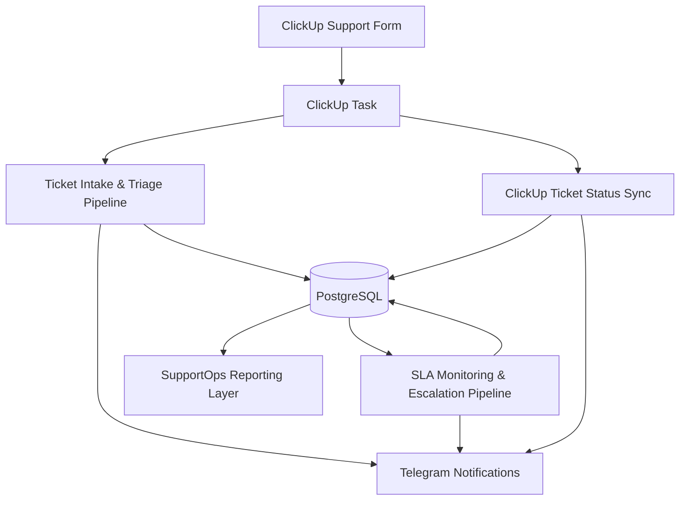
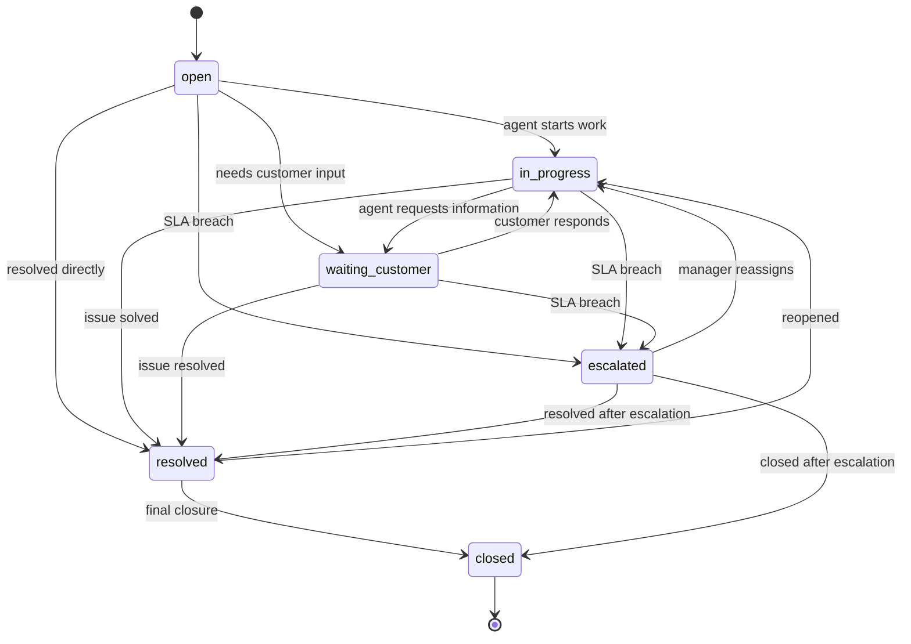

# Customer Support Ticket Triage & SLA Automation System

A portfolio-grade SupportOps automation system built with **n8n**, **ClickUp**, **PostgreSQL**, and **Telegram**.

The system processes ClickUp support form submissions, normalizes ticket data, classifies tickets by category and priority, calculates SLA deadlines, assigns responsible teams, monitors SLA warnings and breaches, escalates overdue tickets, and syncs ClickUp status changes into PostgreSQL for reporting and auditability.

This project demonstrates how workflow automation can be designed as a reliable operations system with database-backed state management, SLA tracking, status lifecycle control, audit logs, and human-operational visibility.

---

## Table of Contents

* [Overview](#overview)
* [Problem](#problem)
* [Solution](#solution)
* [System Architecture](#system-architecture)
* [Workflow Overview](#workflow-overview)
* [Database Design](#database-design)
* [Ticket Lifecycle](#ticket-lifecycle)
* [SLA Management](#sla-management)
* [Reliability Patterns](#reliability-patterns)
* [Example Notifications](#example-notifications)
* [Repository Structure](#repository-structure)
* [Testing Scenarios](#testing-scenarios)
* [Production Considerations](#production-considerations)
* [Key Takeaways](#key-takeaways)

---

## Overview

This project models a realistic customer support operations workflow.

A support request is submitted through a ClickUp form and becomes a ClickUp task. n8n receives the task event, normalizes the payload, stores the raw event in PostgreSQL, classifies the ticket, determines priority, calculates SLA, assigns the responsible support team, creates a local ticket record, writes audit logs, and sends Telegram notifications.

The system also monitors open tickets for SLA warnings and breaches, escalates overdue tickets, and syncs ticket status changes from ClickUp back into PostgreSQL.

---

## Problem

Support workflows often start simple:

1. A customer submits a form.
2. A ticket is created.
3. A support agent responds manually.

But real SupportOps systems need more structure:

* requests must be classified by category
* priority should be assigned consistently
* responsible teams need to be routed automatically
* SLA deadlines must be calculated and monitored
* overdue tickets should be escalated
* status changes should be tracked
* operational history should be auditable
* reporting should not depend only on ClickUp UI state

Without a database-backed state and logging layer, it is difficult to understand what happened, when SLA was breached, who handled the ticket, and how the ticket lifecycle evolved.

---

## Solution

This project uses:

* **ClickUp** as the operational ticket workspace
* **n8n** as the workflow orchestration layer
* **PostgreSQL** as the state, SLA, audit, and reporting layer
* **Telegram** as the notification and alerting layer

The system stores both raw incoming events and structured ticket records. It separates operational task management in ClickUp from reporting, SLA, and audit logic in PostgreSQL.

---

## System Architecture



### Architectural Responsibilities

| Component  | Responsibility                                              |
| ---------- | ----------------------------------------------------------- |
| ClickUp    | Operational ticket workspace and task status source         |
| n8n        | Workflow orchestration, routing, classification, sync logic |
| PostgreSQL | Raw events, tickets, SLA state, logs, audit trail           |
| Telegram   | Notifications, SLA warnings, escalation alerts              |

---

## Workflow Overview

The system consists of three connected n8n workflows.

### 1. Ticket Intake & Triage Pipeline

Processes new support tickets created from ClickUp form submissions.

Main responsibilities:

* receive ClickUp task/form payload
* normalize custom fields
* validate required ticket data
* store raw event in PostgreSQL
* prevent duplicate event processing
* classify ticket category
* determine ticket priority
* calculate SLA deadline
* assign responsible team/member
* create local ticket record
* write ticket logs and workflow logs
* send Telegram notification
* mark raw event as completed

### 2. SLA Monitoring & Escalation Pipeline

Runs on schedule and monitors open tickets against SLA deadlines.

Main responsibilities:

* find tickets approaching SLA breach
* send SLA warning notifications
* mark warning as sent
* find tickets where SLA is already breached
* update ticket status to `escalated`
* write ticket logs and workflow logs
* send escalation notifications

### 3. ClickUp Ticket Status Sync

Synchronizes task status changes from ClickUp into PostgreSQL.

Main responsibilities:

* listen for ClickUp task update events
* detect status change events
* normalize ClickUp statuses
* find the matching local ticket
* validate allowed status transitions
* update local ticket status
* set `first_response_at` and `resolved_at`
* write ticket logs and workflow logs
* send Telegram notification

---

## Database Design

The project extends a shared automation platform schema.

### Shared Layer

| Table           | Purpose                                  |
| --------------- | ---------------------------------------- |
| `raw_events`    | Stores original incoming events as JSONB |
| `workflow_logs` | Stores technical workflow execution logs |

### SupportOps Domain

| Table          | Purpose                                         |
| -------------- | ----------------------------------------------- |
| `tickets`      | Stores structured support tickets and SLA state |
| `ticket_logs`  | Stores business-level ticket history            |
| `sla_policies` | Stores SLA rules by priority                    |
| `team_members` | Stores team assignment data                     |

### Example Table Responsibilities

`raw_events` answers:

```text
What event came into the system?
Was it processed successfully?
Did it fail validation?
```

`workflow_logs` answers:

```text
What did the automation do?
Which step succeeded, failed, or was skipped?
```

`tickets` answers:

```text
What is the current business state of the support ticket?
Who owns it?
When is SLA due?
```

`ticket_logs` answers:

```text
What happened to the ticket over time?
Who changed the status?
Was it escalated?
```

---

## Ticket Lifecycle



Supported statuses:

* `open`
* `in_progress`
* `waiting_customer`
* `resolved`
* `closed`
* `escalated`

---

## SLA Management

SLA rules are stored in the `sla_policies` table.

Example policies:

| Priority | First Response SLA | Resolution SLA |
| -------- | -----------------: | -------------: |
| low      |           24 hours |       72 hours |
| medium   |            8 hours |       24 hours |
| high     |            2 hours |        8 hours |
| urgent   |         30 minutes |        4 hours |

SLA deadline is calculated during ticket intake:

```text
sla_due_at = now + response_time_minutes
```

The SLA Monitoring workflow checks:

### SLA Warning

```text
status IN ('open', 'in_progress')
sla_due_at > now
sla_due_at <= now + 30 minutes
sla_warning_sent_at IS NULL
```

### SLA Breach

```text
status IN ('open', 'in_progress')
sla_due_at <= now
escalated_at IS NULL
```

When SLA is breached, the system updates the ticket to:

```text
status = escalated
```

and writes both `ticket_logs` and `workflow_logs`.

---

## Reliability Patterns

This project demonstrates several reliability and workflow architecture patterns.

### Raw Event Storage

Incoming ClickUp payloads are stored in `raw_events.payload` as JSONB for traceability, debugging, and replay.

### Deduplication

Incoming support events are checked by external ClickUp task ID to prevent duplicate processing.

### Database-Backed State Management

Ticket status, SLA deadlines, warning state, escalation timestamps, and lifecycle timestamps are stored in PostgreSQL.

### SLA State Tracking

The system uses:

* `sla_due_at`
* `sla_warning_sent_at`
* `escalated_at`
* `first_response_at`
* `resolved_at`

### Status Transition Validation

ClickUp status changes are normalized and validated before updating local state.

### Audit Logging

The system separates:

* `workflow_logs` for automation-level execution history
* `ticket_logs` for business-level ticket history

### Operational Alerting

Telegram notifications are sent for:

* new ticket triage
* SLA warnings
* SLA breaches
* ClickUp status sync events
* rejected status transitions
* missing local ticket sync attempts

---

## Example Notifications

### New Support Ticket

```text
🎫 New support ticket triaged

Ticket: cu_support_00001
Subject: Payment failed but invoice was generated

Category: billing
Priority: high

Assigned team: Billing
Assigned to: alice.support@example.com

SLA due at: 2026-06-02 21:11:30

Requester: Laura Adams <laura.adams@example.com>
Company: Adams Retail Group
```

### SLA Warning

```text
⚠️ SLA warning

Ticket: cu_support_00002
Subject: Production webhook integration is down

Priority: urgent
Category: technical

Assigned team: Technical
Assigned to: bob.technical@example.com

SLA due at: 2026-06-02 20:26:37

Action: please respond before SLA breach.
```

### SLA Breach

```text
🚨 SLA breached

Ticket: cu_support_00003
Subject: Cannot access admin account

Priority: urgent
Category: account

Assigned team: Customer Success
Assigned to: clara.success@example.com

Status: escalated

Action: manager attention required.
```

### Status Sync

```text
🔄 ClickUp ticket status synced

Ticket: cu_support_00001
Subject: Payment failed but invoice was generated

New status: resolved
Priority: high
Category: billing

Assigned team: Billing
Assigned to: alice.support@example.com

Requester: laura.adams@example.com
```

---

## Repository Structure

```text
supportops-ticket-triage-sla-automation/
│
├── README.md
│
├── workflows/
│   ├── ticket-intake-triage-pipeline.json
│   ├── sla-monitoring-escalation-pipeline.json
│   └── clickup-ticket-status-sync.json
│
├── database/
│   ├── supportops-extension.sql
│   ├── dbml.dbml
│   └── sample-payloads.json
│
├── docs/
│   ├── architecture.md
│   ├── ticket-lifecycle.md
│   ├── sla-management.md
│   ├── reliability-patterns.md
│   └── testing-scenarios.md
│
└── screenshots/
    ├── ticket-intake-triage-pipeline.png
    ├── sla-monitoring-escalation-pipeline.png
    ├── clickup-ticket-status-sync.png
    ├── telegram-sla-warning.png
    └── telegram-status-sync.png
```

---

## Testing Scenarios

### 1. Ticket Intake Happy Path

Submit a valid ClickUp support form payload.

Expected result:

* raw event is inserted
* ticket is created
* category and priority are assigned
* SLA is calculated
* support owner is assigned
* Telegram notification is sent
* raw event becomes `completed`

### 2. Invalid Ticket Payload

Submit a payload with missing requester email.

Expected result:

* raw event is inserted
* event becomes `manual_review`
* error message contains `missing_requester_email`
* no ticket is created

### 3. Duplicate Event

Submit the same ClickUp task ID twice.

Expected result:

* duplicate event is detected
* second processing attempt is skipped
* duplicate event log is created

### 4. SLA Warning

Set a ticket SLA deadline within the warning window.

Expected result:

* SLA warning notification is sent
* `sla_warning_sent_at` is populated
* ticket log and workflow log are created

### 5. SLA Breach

Set a ticket SLA deadline in the past.

Expected result:

* ticket status becomes `escalated`
* `escalated_at` is populated
* escalation notification is sent
* ticket log and workflow log are created

### 6. ClickUp Status Sync

Simulate a ClickUp status update.

Expected result:

* local ticket status is updated
* `first_response_at` is set on first agent response
* `resolved_at` is set when ticket becomes resolved
* ticket log and workflow log are created

### 7. Reopened Ticket

Move a ticket from `resolved` back to `in_progress`.

Expected result:

* transition is accepted as a reopen scenario
* ticket status becomes `in_progress`
* ticket log records the transition

### 8. Invalid Status Transition

Try to move a `closed` ticket back to `in_progress`.

Expected result:

* transition is rejected
* Telegram warning is sent
* local ticket status is not changed

---

## Production Considerations

This is a portfolio/demo project. In a production environment, the following improvements would be required:

* secure ClickUp webhook verification
* credential and secret management
* parameterized SQL queries
* real ClickUp custom field mapping
* ClickUp API updates for assignee, priority, comments, and custom fields
* dashboard for SLA and support queue monitoring
* role-based status transition permissions
* stronger audit trail for human actions
* business-hours-aware SLA calculation
* retry handling for failed ClickUp or Telegram API calls
* dead-letter queue for invalid or unprocessed events
* automated detection of stuck tickets

---

## Key Takeaways

This project demonstrates how to design support workflow automation as a reliable system rather than a simple tool-to-tool integration.

The main architecture principle is:

```text
ClickUp is the operational ticket workspace.
n8n orchestrates classification, SLA logic, sync, and alerts.
PostgreSQL stores state, logs, SLA data, and audit history.
Telegram provides real-time operational visibility.
```

The result is a small but realistic SupportOps automation system covering intake, triage, SLA monitoring, escalation, and status synchronization.