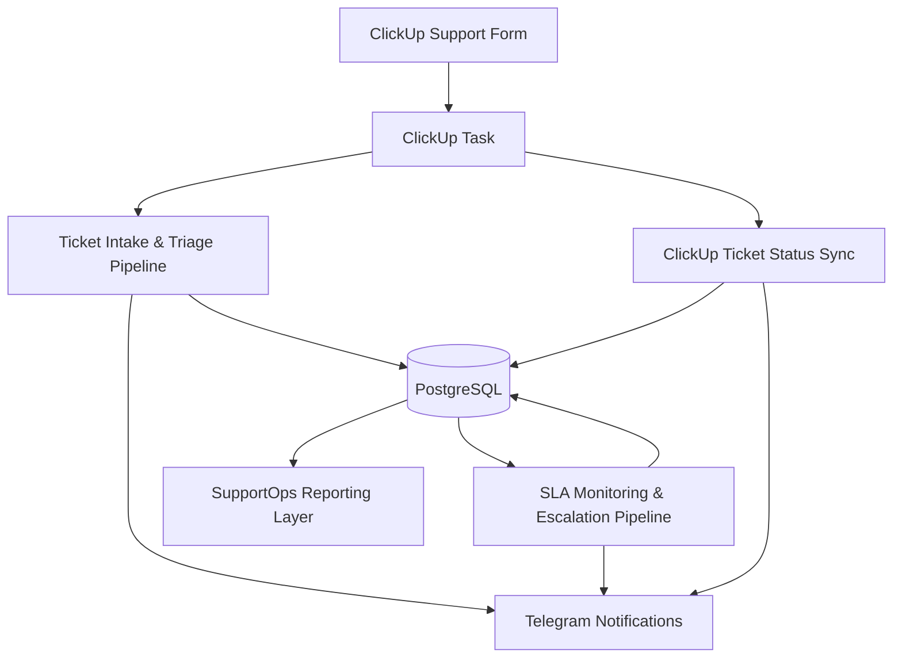

# Architecture

## Overview

The **Customer Support Ticket Triage & SLA Automation System** is a SupportOps automation system built with **n8n**, **ClickUp**, **PostgreSQL**, and **Telegram**.

The system receives support requests from ClickUp, processes and classifies them through n8n, stores structured operational state in PostgreSQL, monitors SLA deadlines, escalates overdue tickets, and sends operational notifications to Telegram.

This project demonstrates how support workflow automation can be designed as a reliable system rather than a simple tool-to-tool integration.

---

## Core Architecture Principle

```text
ClickUp is the operational ticket workspace.
n8n is the orchestration layer.
PostgreSQL is the state, SLA, audit, and reporting layer.
Telegram is the notification and alerting layer.
```

The key idea is to separate where agents work from where automation state is stored.

ClickUp is used by support agents and managers to work with tickets. PostgreSQL is used to store automation state, ticket metadata, SLA information, logs, and reporting data. n8n connects both layers and executes business logic.

---

## High-Level Architecture



---

## Components

| Component | Responsibility |
|---|---|
| ClickUp | Operational ticket workspace and task status source |
| n8n | Workflow orchestration, classification, routing, SLA logic, sync logic |
| PostgreSQL | Raw events, tickets, SLA state, logs, reporting, audit trail |
| Telegram | Operational notifications, SLA warnings, escalation alerts |
| GitHub | Project documentation, workflow exports, database schema, case study |

---

## Workflow Set

The system consists of three main workflows.

### 1. Ticket Intake & Triage Pipeline

This workflow processes new support tickets created from ClickUp form submissions.

Responsibilities:

- receive ClickUp task/form payload
- normalize ClickUp custom fields
- validate required ticket data
- store raw incoming event in PostgreSQL
- check duplicate events
- classify ticket category
- determine ticket priority
- calculate SLA deadline
- assign support team and owner
- create local ticket record
- write ticket logs and workflow logs
- send Telegram notification
- mark raw event as completed

### 2. SLA Monitoring & Escalation Pipeline

This workflow runs on schedule and monitors open tickets against SLA deadlines.

Responsibilities:

- find tickets approaching SLA breach
- send SLA warning notification
- mark warning as sent
- find tickets where SLA has already been breached
- update ticket status to `escalated`
- write ticket logs
- write workflow logs
- send escalation notification

### 3. ClickUp Ticket Status Sync

This workflow synchronizes ClickUp task status changes into PostgreSQL.

Responsibilities:

- listen for ClickUp task update events
- detect whether the update is a status change
- normalize ClickUp status names
- find the matching local ticket by ClickUp task ID
- validate allowed status transitions
- update local ticket status
- set lifecycle timestamps such as `first_response_at` and `resolved_at`
- write ticket logs
- write workflow logs
- send Telegram notification

---

## Data Ownership

### ClickUp

ClickUp owns the operational ticket experience.

Agents use ClickUp to:

- view support tasks
- change statuses
- manage operational work
- collaborate with teammates

### PostgreSQL

PostgreSQL owns structured automation state.

It stores:

- raw event payloads
- ticket records
- SLA deadlines
- warning and escalation timestamps
- first response timestamps
- resolution timestamps
- workflow execution logs
- business-level ticket logs

### n8n

n8n owns workflow execution.

It handles:

- data normalization
- validation
- branching
- SQL queries
- SLA calculations
- notifications
- ClickUp-to-PostgreSQL synchronization

---

## Database Layer

The system extends a shared automation platform schema.

### Shared Tables

| Table | Purpose |
|---|---|
| `raw_events` | Stores original incoming events as JSONB |
| `workflow_logs` | Stores technical workflow execution logs |

### SupportOps Tables

| Table | Purpose |
|---|---|
| `tickets` | Stores structured support ticket data and SLA state |
| `ticket_logs` | Stores business-level ticket history |
| `sla_policies` | Stores SLA rules by ticket priority |
| `team_members` | Stores assignment data for routing tickets |

---

## Logging Model

The system separates two kinds of logs.

### workflow_logs

`workflow_logs` answers:

```text
What did the automation do?
Which workflow step succeeded, failed, or was skipped?
```

Examples:

- `raw_event_inserted`
- `ticket_created`
- `sla_warning_sent`
- `sla_breach_detected`
- `clickup_status_synced`

### ticket_logs

`ticket_logs` answers:

```text
What happened to the ticket as a business object?
How did its state change over time?
Who or what changed it?
```

Examples:

- `ticket_created`
- `status_changed`
- `status_synced_from_clickup`
- `sla_warning_sent`

---

## Event and Ticket Separation

The system separates event processing from ticket lifecycle.

### raw_events.processing_status

Represents processing state of incoming events.

Examples:

- `processing`
- `completed`
- `manual_review`
- `failed`

### tickets.status

Represents business state of the support ticket.

Examples:

- `open`
- `in_progress`
- `waiting_customer`
- `resolved`
- `closed`
- `escalated`

This separation prevents confusion between technical event processing and business ticket state.

---

## Operational Flow

Typical happy path:

```text
ClickUp form submission
→ ClickUp task created
→ n8n receives task payload
→ payload normalized
→ raw event stored
→ ticket classified
→ priority assigned
→ SLA calculated
→ support owner assigned
→ ticket created in PostgreSQL
→ Telegram notification sent
→ raw event marked completed
```

Typical SLA path:

```text
Ticket remains open
→ SLA deadline approaches
→ warning notification sent
→ warning timestamp stored
→ SLA deadline passes
→ ticket escalated
→ escalation timestamp stored
→ Telegram alert sent
```

Typical status sync path:

```text
Agent changes ClickUp task status
→ n8n receives task update
→ status change detected
→ local ticket found
→ transition validated
→ local ticket status updated
→ ticket log written
→ workflow log written
→ Telegram notification sent
```

---

## Why This Architecture Matters

This design avoids relying only on ClickUp UI state for operational reliability.

By storing structured state in PostgreSQL, the system can support:

- auditability
- reporting
- SLA monitoring
- historical analysis
- automation recovery
- debugging
- future dashboarding
- cross-workflow orchestration

The result is a realistic SupportOps automation system that combines SaaS workflows with database-backed reliability patterns.