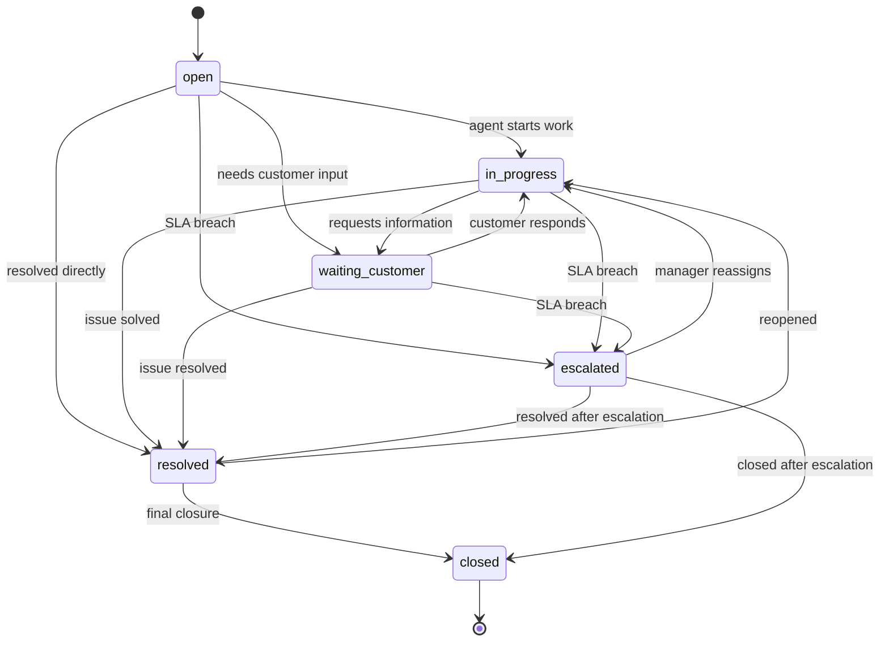

# Ticket Lifecycle

## Overview

The ticket lifecycle is stored in the `tickets.status` field.

This lifecycle describes the business state of a support ticket, not the technical state of the incoming event.

The incoming event is tracked in `raw_events.processing_status`, while the support ticket itself is tracked in `tickets.status`.

---

## Supported Ticket Statuses

| Status | Meaning |
|---|---|
| `open` | Ticket has been created and is waiting for agent action |
| `in_progress` | Agent has started working on the ticket |
| `waiting_customer` | Agent is waiting for additional input from the customer |
| `resolved` | Issue has been resolved but not fully closed |
| `closed` | Ticket is fully closed |
| `escalated` | Ticket was escalated due to SLA breach or operational priority |

---

## Lifecycle Diagram



---

## Status Transition Rules

The workflow validates status transitions before updating PostgreSQL.

### Allowed Transitions

| Current Status | Allowed Next Statuses |
|---|---|
| `open` | `in_progress`, `waiting_customer`, `resolved`, `closed`, `escalated` |
| `in_progress` | `waiting_customer`, `resolved`, `closed`, `escalated` |
| `waiting_customer` | `in_progress`, `resolved`, `closed`, `escalated` |
| `resolved` | `closed`, `in_progress` |
| `escalated` | `in_progress`, `resolved`, `closed` |
| `closed` | none |

---

## Reopen Scenario

The transition from `resolved` back to `in_progress` is allowed.

This represents a realistic support scenario where:

- the customer replies that the issue is not actually resolved
- the agent discovers additional work is needed
- the ticket needs another investigation cycle

Example:

```text
resolved → in_progress
```

This is treated as a ticket reopen scenario.

---

## Closed as Terminal State

In v1, `closed` is treated as a terminal state.

Once a ticket is closed, the workflow does not allow it to move back to another state.

Example rejected transition:

```text
closed → in_progress
```

This protects historical reporting and prevents accidental reopening of completed tickets.

---

## first_response_at

The field `first_response_at` is set when an agent first moves the ticket out of `open` into an active or meaningful response state.

It is populated when:

```text
old status = open
new status IN ('in_progress', 'waiting_customer', 'resolved')
```

This allows the system to measure time to first response.

---

## resolved_at

The field `resolved_at` is set when the ticket moves to:

```text
resolved
```

This allows the system to measure time to resolution.

---

## escalated_at

The field `escalated_at` is set when the SLA Monitoring workflow detects a breach and moves the ticket to:

```text
escalated
```

This allows the system to track SLA breaches and escalation history.

---

## Ticket Logs

Every important business transition is written to `ticket_logs`.

Example:

```text
action: status_synced_from_clickup
old_value: in_progress
new_value: resolved
actor_type: agent
actor_name: Alice Support
message: Ticket status synced from ClickUp.
```

---

## Workflow Logs

Every important automation step is written to `workflow_logs`.

Example:

```text
workflow_name: ClickUp Ticket Status Sync
step_name: clickup_status_synced
status: success
wf_message: Ticket status synced from ClickUp: in_progress → resolved.
```

---

## Why Lifecycle Validation Matters

Without lifecycle validation, any status could be written to the database at any time.

This can cause:

- incorrect reporting
- broken SLA metrics
- invalid ticket states
- confusing audit history
- unreliable automation behavior

The validation layer makes the ticket lifecycle predictable and auditable.